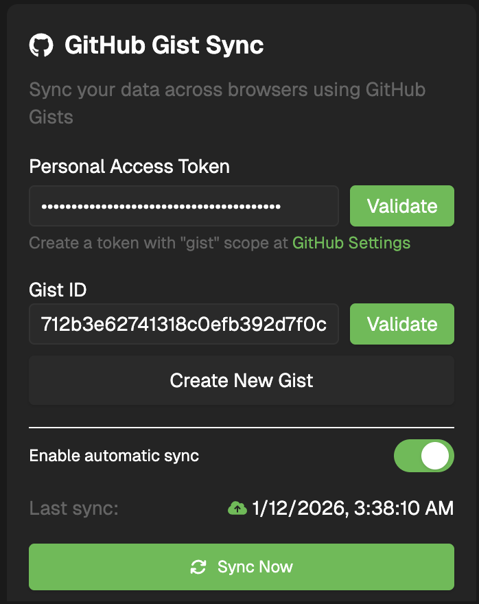

# LeetSRS

 

LeetSRS is a [Chrome extension](https://chromewebstore.google.com/detail/odgfcigkohoimpeeooifjdglncggkgko?utm_source=item-share-cb) that adds spaced repetition to LeetCode problem practice.

## Screenshots

### In Extension

&nbsp;&nbsp;

&nbsp;&nbsp;

### Works directly on leetcode.com

## Features

### Spaced Repetition

- Uses **[TS-FSRS](https://github.com/open-spaced-repetition/ts-fsrs)** for the spaced repetition algorithm

### Review System

- Daily review queue with optimized problem ordering
- Customizable daily new card limits
- View statistics and streaks
- Works directly on leetcode.com
- Easily rate after solving problems, or add to review later

### Cross-Browser Sync

- Optional sync via GitHub Gists
- Keep your cards and progress in sync across multiple browsers
- Your data stays private in your own GitHub account

## Setup Requirements

In the extension's settings, under the "GitHub Gist Sync" section

#### 1. Create a GitHub Personal Access Token

- Generate a new token with the **`gist`** permission enabled
- Save the token somewhere secure

#### 2. Create a Gist

- Use the **Create New Gist** button in the extension to do this automatically. Alternatively, create a Gist on GitHub and copy its ID.

#### 3. Enable Sync on Each Device

On every browser or machine you want synced:

- Paste your **GitHub token**
- Paste the same **Gist ID**

Once configured, your cards and progress will automatically stay in sync across all your devices.

### Interface

- Dark/light theme support

## Open Source

LeetSRS is open source and accepts contributions.

## Installation

1. Download the latest release from the [Chrome Web Store](https://chromewebstore.google.com/detail/odgfcigkohoimpeeooifjdglncggkgko?utm_source=item-share-cb)
2. Or build from source and load as an unpacked extension

## License

MIT
